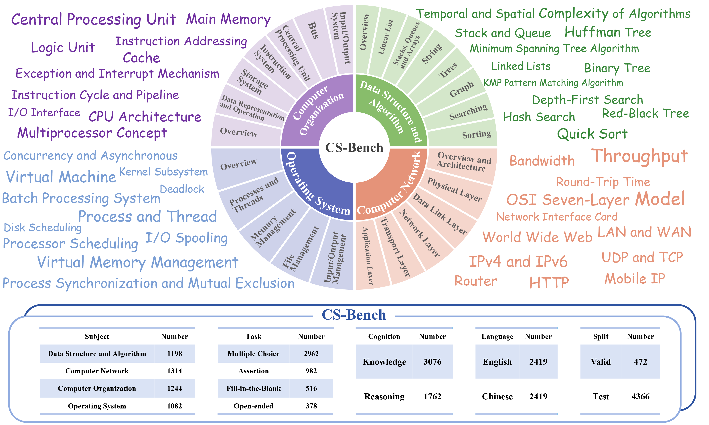
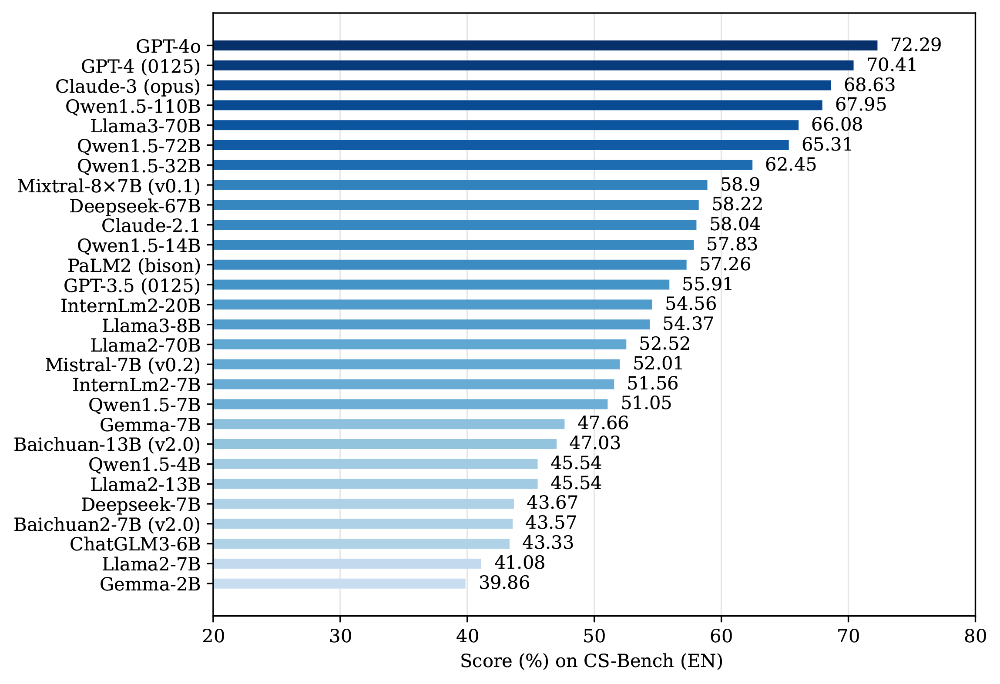
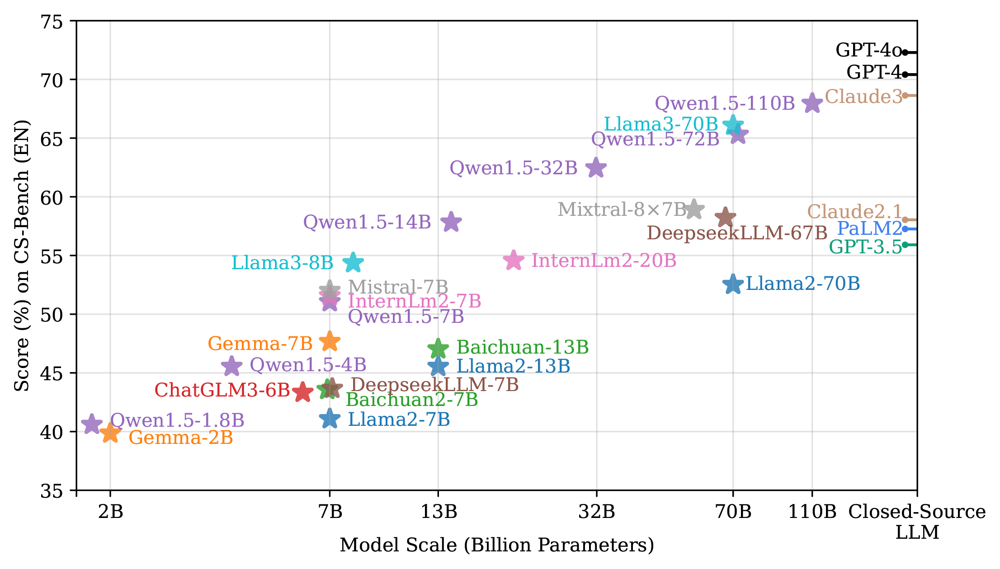

# CS-Bench: A Comprehensive Benchmark for Large Language Models towards Computer Science Mastery

 
 
 
  
 
 
 


Code for the Paper "[CS-Bench: A Comprehensive Benchmark for Large Language Models towards Computer Science Mastery](https://pris-nlp.github.io/)".

For more details, please refer to the project page with dataset exploration and key results: [https://csbench.github.io/](https://csbench.github.io/).

:bell: If you have any questions or suggestions, please don't hesitate to let us know. You can comment on the [Email](https://csbench2024@gmail.com), or post an issue on this repository.


[[Webpage](https://csbench.github.io/)] [[Paper](https://pris-nlp.github.io/)] [[Huggingface Dataset](https://huggingface.co/datasets/CS-Bench/CS-Bench)] [[Leaderboard](https://csbench.github.io/#leaderboard)] [[Result Explorer](https://csbench.github.io/#explorer)]

<p align="center">
     <br>
  Tentative logo for <b>CS-Bench</b>. 
</p>

## Outlines

- [💥 News 💥](https://github.com/lupantech/MathVista/blob/main/README.md#-news-)
- [👀 About MathVista](https://github.com/lupantech/MathVista/blob/main/README.md#-about-mathvista)
- [🏆 Leaderboard 🏆](https://github.com/lupantech/MathVista/blob/main/README.md#-leaderboard-)
  - [Contributing the Leaderboard](https://github.com/lupantech/MathVista/blob/main/README.md#contributing-the-leaderboard)
  - [Leaderboard on the testmini subset](https://github.com/lupantech/MathVista/blob/main/README.md#leaderboard-on-the-testmini-subset)
  - [Leaderboard on the test subset](https://github.com/lupantech/MathVista/blob/main/README.md#leaderboard-on-the-test-subset)
- [📊 Dataset Examples](https://github.com/lupantech/MathVista/blob/main/README.md#-dataset-examples)
- [📖 Dataset Usage](https://github.com/lupantech/MathVista/blob/main/README.md#-dataset-usage)
  - [Data Source](https://github.com/lupantech/MathVista/blob/main/README.md#-dataset-usage)
  - [Data Downloading](https://github.com/lupantech/MathVista/blob/main/README.md#data-downloading)
  - [Data Format](https://github.com/lupantech/MathVista/blob/main/README.md#data-format)
  - [Data Visualization](https://github.com/lupantech/MathVista/blob/main/README.md#data-visualization)
  - [Usage Demos](https://github.com/lupantech/MathVista/blob/main/README.md#usage-demos)
- [🔮 Evaluations on MathVista](https://github.com/lupantech/MathVista/blob/main/README.md#-evaluations-on-mathvista)
  - [Requirements (Optional)](https://github.com/lupantech/MathVista/blob/main/README.md#requirements-optional)
  - [Downloading Images (Optional)](https://github.com/lupantech/MathVista/blob/main/README.md#downloading-images-optional)
  - [Evaluation Pipelines](https://github.com/lupantech/MathVista/blob/main/README.md#evaluation-pipelines)
- [📝 Evaluation Scripts of Our Models](https://github.com/lupantech/MathVista/blob/main/README.md#-evaluation-scripts-of-our-models)
  - [Evaluating Multimodal Bard](https://github.com/lupantech/MathVista/blob/main/README.md#evaluating-multimodal-bard)
  - [Evaluating Chain-of-Thought GPT-4](https://github.com/lupantech/MathVista/blob/main/README.md#evaluating-chain-of-thought-gpt-4)
  - [Evaluating Program-of-Thought GPT-4](https://github.com/lupantech/MathVista/blob/main/README.md#evaluating-program-of-thought-gpt-4)
  - [Evaluating More Settings](https://github.com/lupantech/MathVista/blob/main/README.md#evaluating-more-settings)
  - [Evaluating Large Multimodal Models](https://github.com/lupantech/MathVista/blob/main/README.md#evaluating-large-multimodal-models)
- [📈 Evaluation Results](https://github.com/lupantech/MathVista/blob/main/README.md#-evaluation-results)
- [📜 License](https://github.com/lupantech/MathVista/blob/main/README.md#-license)
- [☕ Stay Connected!](https://github.com/lupantech/MathVista/blob/main/README.md#coffee-stay-connected)
- [✅ Cite](https://github.com/lupantech/MathVista/blob/main/README.md#white_check_mark-cite)
- [🧠 Related Work](https://github.com/lupantech/MathVista/blob/main/README.md#-related-work)
- [🤝 Contributors](https://github.com/lupantech/MathVista/blob/main/README.md#-contributors)


## 💥 News 💥
- **[2023.6.14]** Our paper is now accessible at https://pris-nlp.github.io/.
- **[2024.6.13]** Our dataset is now accessible at [Huggingface Datasets](https://huggingface.co/datasets/CS-Bench/CS-Bench).
- **[2024.6.12]** Our project homepage can be accessed at https://csbench.github.io/.


## 👀 About CS-Bench

**Computer Science (CS)** stands as a testament to the intricacies of human intelligence, profoundly advancing the development of artificial intelligence and modern society. However, the current community of **large language models (LLMs)** overly focuses on benchmarks for analyzing specific foundational skills (e.g. mathematics and code generation), neglecting an all-round evaluation of the computer science field. To bridge this gap, **we introduce CS-Bench**, the first bilingual (Chinese-English) benchmark dedicated to evaluating the performance of LLMs in computer science. CS-Bench comprises approximately 5K meticulously curated test samples, covering 26 subfields across 4 key areas of computer science, encompassing various task forms and divisions of knowledge and reasoning. Utilizing CS-Bench, **we conduct a comprehensive evaluation of over 30 mainstream LLMs**, revealing the relationship between CS performance and model scales. We also quantitatively analyze the reasons for failures in existing LLMs and highlight directions for improvements, including knowledge supplementation and CS-specific reasoning. Further **cross-capability experiments** show a high correlation between LLMs' capabilities in computer science and their abilities in mathematics and coding. Moreover, expert LLMs specialized in mathematics and coding also demonstrate strong performances in several CS subfields. Looking ahead, we envision CS-Bench serving as a cornerstone for LLM applications in the CS field and paving new avenues in assessing LLMs' diverse reasoning capabilities.


<p align="center">
     <br>
  Overview diagram and statistics of <b>CS-Bench</b>.
</p>

For more details, you can find our project page [here](https://csbench.github.io/) and our paper [here](https://pris-nlp.github.io/).

## 🏆 Leaderboard on CS-Bench (English) 🏆

### Contributing the Leaderboard

🚨🚨 The leaderboard is continuously being updated. 

The evaluation instructions are available at [🔮 Evaluations on MathVista](https://github.com/lupantech/MathVista?tab=readme-ov-file#-evaluations-on-mathvista) and [📝 Evaluation Scripts of Our Models](https://github.com/lupantech/MathVista?tab=readme-ov-file#-evaluation-scripts-of-our-models).

To submit your results to the leaderboard on the **testmini** subset, please send to [this email](mailto:lupantech@gmail.com) with your result json file and score json file, referring to the template files below:

- [output_testmini_template_for_leaderboard_submission.json](https://github.com/lupantech/MathVista/blob/main/results/leaderboad_submission_template/output_testmini_template_for_leaderboard_submission.json)
- [scores_testmini_template_for_leaderboard_submission.json](https://github.com/lupantech/MathVista/blob/main/results/leaderboad_submission_template/scores_testmini_template_for_leaderboard_submission.json)

To submit your results to the leaderboard on the **test** subset, please send to [this email](mailto:lupantech@gmail.com) with your result file (**we will generate the score file for you**),  referring to the template file below:

- [output_test_template_for_leaderboard_submission.json](https://github.com/lupantech/MathVista/blob/main/results/leaderboad_submission_template/output_test_template_for_leaderboard_submission.json)

### Overall

<p align="center">
     <br>
  The leaderboard of LLMs on <b>CS-Bench (EN) </b>.
</p>

<p align="center">
     <br>
 The leaderboard of LLMs on <b>CS-Bench (EN)</b>.
</p>

### Detailed scores


| Model               | Data Struc & Algo |               |               | Computer Organization |               |               | Computer Network |               |               | Operating System |               |               | Overall          |               |               |
|---------------------|-------------------|---------------|---------------|-----------------------|---------------|---------------|------------------|---------------|---------------|------------------|---------------|---------------|------------------|---------------|---------------|
|                     | Klg               | Rng           | Avg           | Klg                   | Rng           | Avg           | Klg              | Rng           | Avg           | Klg              | Rng           | Avg           | Klg              | Rng           | Avg           |
| Random              | 28.04             | 24.63         | 26.65         | 26.57                 | 25.24         | 26.13         | 26.34            | 22.49         | 24.98         | 29.06            | 24.23         | 27.27         | 27.4             | 24.12         | 26.2           |
| *Open-source LLM (Scale < 10B)* |                   |               |               |                       |               |               |                  |               |               |                  |               |               |                  |               |               |
| Gemma-2B            | 56.76             | 23.44         | 43.20         | 47.69                 | 30.18         | 41.92         | 45.22            | 26.38         | 38.59         | 37.79            | 31.32         | 35.39         | 46.89            | 27.59         | 39.86          |
| Qwen1.5-4B          | 58.76             | 36.56         | 49.72         | 52.31                 | 33.88         | 46.23         | 52.70            | 33.97         | 46.11         | 40.03            | 38.52         | 39.47         | 51.18            | 35.70         | 45.54          |
| ChatGLM3-6B         | 51.10             | 34.08         | 44.17         | 48.11                 | 32.73         | 43.04         | 51.15            | 32.66         | 44.64         | 43.57            | 37.03         | 41.14         | 48.63            | 34.07         | 43.33          |
| Llama2-7B           | 51.51             | 32.61         | 43.82         | 48.89                 | 31.82         | 43.26         | 46.72            | 30.75         | 41.10         | 41.04            | 26.26         | 35.55         | 47.15            | 30.48         | 41.08          |
| DeepseekLLM-7B      | 56.42             | 28.94         | 45.23         | 52.09                 | 32.48         | 45.62         | 52.43            | 31.41         | 45.03         | 41.66            | 31.98         | 38.06         | 50.87            | 31.11         | 43.67          |
| Baichuan2-7B        | 53.11             | 34.95         | 45.72         | 45.10                 | 38.67         | 42.98         | 51.26            | 34.27         | 45.28         | 43.47            | 33.63         | 39.82         | 48.29            | 35.33         | 43.57          |
| Gemma-7B            | 59.53             | 35.18         | 49.62         | 49.97                 | 33.27         | 44.46         | 60.87            | 37.09         | 52.50         | 48.67            | 34.23         | 43.31         | 54.90            | 35.02         | 47.66          |
| Qwen1.5-7B          | 59.90             | 35.28         | 49.88         | 55.21                 | 42.73         | 51.09         | 61.56            | 43.02         | 55.04         | 52.01            | 39.78         | 47.47         | 57.34            | 40.08         | 51.05          |
| InternLm2-7B        | 59.57             | 40.92         | 51.98         | 58.83                 | 37.94         | 51.94         | 62.65            | 40.60         | 54.89         | 50.94            | 39.29         | 46.61         | 58.31            | 39.77         | 51.56          |
| Mistral-7B          | 63.24             | 34.86         | 51.69         | 57.52                 | 38.67         | 51.30         | 61.48            | 44.92         | 55.65         | 51.66            | 43.79         | 48.73         | 58.63            | 40.44         | 52.01          |
| Llama3-8B           | 66.25             | 37.29         | 54.46         | 55.38                 | 40.67         | 50.53         | 62.21            | 53.02         | 58.98         | 55.26            | 49.34         | 53.06         | 59.75            | 44.97         | 54.37          |
| *Open-source LLM (Scale > 10B)* |                   |               |               |                       |               |               |                  |               |               |                  |               |               |                  |               |               |
| Llama2-13B          | 51.74             | 35.00         | 44.93         | 51.81                 | 36.18         | 46.66         | 53.03            | 37.99         | 47.74         | 48.12            | 32.36         | 42.27         | 51.31            | 35.46         | 45.54          |
| Baichuan-13B        | 54.82             | 33.39         | 46.10         | 50.50                 | 39.52         | 46.88         | 55.87            | 42.21         | 51.06         | 48.44            | 34.73         | 43.35         | 52.53            | 37.44         | 47.03          |
| Qwen1.5-14B         | 64.95             | 46.74         | 57.54         | 60.06                 | 45.58         | 55.28         | 68.66            | 52.91         | 63.12         | 56.56            | 51.48         | 54.67         | 62.79            | 49.18         | 57.83          |
| InternLm2-20B       | 66.72             | 38.21         | 55.11         | 58.38                 | 39.82         | 52.26         | 64.13            | 50.35         | 59.28         | 53.51            | 46.43         | 50.88         | 60.81            | 43.66         | 54.56          |
| Qwen1.5-32B         | 69.70             | 51.19         | 62.17         | 67.63                 | 52.91         | 62.78         | 69.23            | 58.74         | 65.54         | 60.06            | 56.21         | 58.63         | 66.87            | 54.72         | 62.45          |
| Mistral-8×7B        | 70.94             | 40.50         | 58.55         | 66.88                 | 42.06         | 58.70         | 67.49            | 52.86         | 62.34         | 57.56            | 51.65         | 55.37         | 65.91            | 46.66         | 58.90          |
| DeepseekLLM-67B     | 69.70             | 44.17         | 59.31         | 63.59                 | 39.15         | 55.53         | 69.04            | 50.25         | 62.43         | 57.86            | 50.11         | 54.98         | 65.23            | 45.96         | 58.22          |
| Llama2-70B          | 64.28             | 41.51         | 55.01         | 56.35                 | 40.85         | 51.24         | 61.99            | 43.07         | 55.33         | 51.79            | 41.15         | 47.84         | 58.73            | 41.68         | 52.52          |
| Llama3-70B          | 75.72             | 53.03         | 66.48         | 71.45                 | 51.09         | 64.74         | 74.78            | 63.02         | 70.64         | 63.77            | 58.08         | 61.65         | 71.65            | 56.36         | 66.08          |
| Qwen1.5-72B         | 72.71             | 50.69         | 63.75         | 69.28                 | 54.12         | 64.28         | 71.97            | 66.73         | 70.13         | 63.96            | 59.62         | 62.35         | 69.63            | 57.75         | 65.31          |
| Qwen1.5-110B        | 73.11             | 53.58         | 65.16         | 73.65                 | 54.18         | 67.23         | 75.36            | 70.75         | 73.74         | 64.55            | 65.27         | 64.82         | 71.98            | 60.91         | 67.95          |
| *Closed-source LLM* |                   |               |               |                       |               |               |                  |               |               |                  |               |               |                  |               |               |
| PaLM-2              | 70.07             | 38.98         | 57.41         | 63.81                 | 41.91         | 56.59         | 65.11            | 49.43         | 59.59         | 60.41            | 45.96         | 55.22         | 64.85            | 44.01         | 57.26          |
| Claude-2.1          | 68.39             | 44.54         | 58.68         | 62.09                 | 50.24         | 58.18         | 66.58            | 52.81         | 61.74         | 53.93            | 50.55         | 52.67         | 62.97            | 49.42         | 58.04          |
| Claude-3            | 77.53             | 52.25         | 67.24         | 72.53                 | 64.12         | 69.76         | 75.08            | 68.69         | 72.83         | 64.36            | 62.80         | 63.78         | 72.57            | 61.75         | 68.63          |
| GPT-3.5             | 71.34             | 39.22         | 58.27         | 60.78                 | 42.97         | 54.91         | 65.27            | 52.16         | 60.66         | 54.42            | 39.01         | 48.69         | 63.04            | 43.45         | 55.91          |
| GPT-4               | 78.53             | 59.36         | 70.73         | 75.40                 | 59.21         | 70.06         | 77.38            | 67.64         | 73.95         | 67.21            | 64.40         | 66.16         | 74.85            | 62.66         | 70.41          |
| GPT-4o              | 81.51             | 57.80         | 71.86         | 75.60                 | 58.61         | 70.00         | 80.57            | 71.76         | 77.47         | 69.35            | 68.68         | 69.10         | 76.95            | 64.15         | 72.29          |


Some notations in the table:

- **Human Performance\*:** Average human performance from AMT annotators who have high school diplomas or above.

- **Gemini**: the fine-grained scores are from **the Gemini Team, Google**.

- **GPT-4V (Playground)**: the launched playground at https://chat.openai.com/?model=gpt-4; experimental dates range from Oct 7, 2023, to Oct 15, 2023

- **GPT-4**: the `gpt-4-0613` engine

- **Method types**
  -  **MoE 🤖:** Mixture of Experts
  -  **LMM 🖼️:** Large Multimodal Model
  -  **Tool 🛠️:** Tool-augmented Large Language Model
  
- **Task types:** 
  - **FQA:** figure question answering
  - **GPS:** geometry problem solving
  - **MWP:** math word problem solving
  -  **TQA:** textbook question answering
  - **VQA:** visual question answering
- **Mathematical reasoning types:** 
  - **ALG:** algebraic reasoning
  - **ARI:** arithmetic reasoning
  -  **GEO:** geometry reasoning
  - **LOG:** logical reasoning
  - **NUM:** numeric commonsense reasoning
  - **SCI:** scientific reasoning 
  - **STA:** statistical reasoning

🔔 The automatic evaluation on [CodaLab](https://codalab.org/) are under construction. 


## 📊 Dataset Examples

Examples of our newly annotated datasets: **IQTest**, **FunctionQA**, and **PaperQA**:

<p align="center">
     <br>
</p>

<details>
<summary>🔍 Click to expand/collapse more examples</summary>

Examples of seven mathematical reasoning skills:

1. Arithmetic Reasoning


2. Statistical Reasoning


3. Algebraic Reasoning


4. Geometry Reasoning


5. Numeric Commonsense Reasoning


6. Scientific Reasoning


7. Logical Reasoning


</details>

## 📖 Dataset Usage

### Data Source

The **MathVista** dataset is derived from three newly collected datasets: IQTest, FunctionQA, and Paper, as well as 28 other source datasets. Details can be found in the [source.json](https://huggingface.co/datasets/AI4Math/MathVista/blob/main/source.json) file. All these source datasets have been preprocessed and labeled for evaluation purposes.

### Data Downloading

All the data examples were divided into two subsets: *testmini* and *test*.

- **testmini**: 1,000 examples used for model development, validation, or for those with limited computing resources.
- **test**: 5,141 examples for standard evaluation. Notably, the answer labels for test will NOT be publicly released.

You can download this dataset by the following command (make sure that you have installed [Huggingface Datasets](https://huggingface.co/docs/datasets/quickstart)):

```python
from datasets import load_dataset

dataset = load_dataset("AI4Math/MathVista")
```

Here are some examples of how to access the downloaded dataset:

```python
# print the first example on the testmini set
print(dataset["testmini"][0])
print(dataset["testmini"][0]['pid']) # print the problem id 
print(dataset["testmini"][0]['question']) # print the question text 
print(dataset["testmini"][0]['query']) # print the query text
print(dataset["testmini"][0]['image']) # print the image path
print(dataset["testmini"][0]['answer']) # print the answer
dataset["testmini"][0]['decoded_image'] # display the image

# print the first example on the test set
print(dataset["test"][0])
```

We have uploaded a demo to illustrate how to access the MathVista dataset on Hugging Face, available at [hugging_face_dataset_demo.ipynb](https://github.com/lupantech/MathVista/blob/main/jupyter_notebook_demos/hugging_face_dataset_demo.ipynb).

### Data Format

The dataset is provided in json format and contains the following attributes:

```
{
    "question": [string] The question text,
    "image": [string] A file path pointing to the associated image,
    "choices": [list] Choice options for multiple-choice problems. For free-form problems, this could be a 'none' value,
    "unit": [string] The unit associated with the answer, e.g., "m^2", "years". If no unit is relevant, it can be a 'none' value,
    "precision": [integer] The number of decimal places the answer should be rounded to,
    "answer": [string] The correct answer for the problem,
    "question_type": [string] The type of question: "multi_choice" or "free_form",
    "answer_type": [string] The format of the answer: "text", "integer", "float", or "list",
    "pid": [string] Problem ID, e.g., "1",
    "metadata": {
        "split": [string] Data split: "testmini" or "test",
        "language": [string] Question language: "English", "Chinese", or "Persian",
        "img_width": [integer] The width of the associated image in pixels,
        "img_height": [integer] The height of the associated image in pixels,
        "source": [string] The source dataset from which the problem was taken,
        "category": [string] The category of the problem: "math-targeted-vqa" or "general-vqa",
        "task": [string] The task of the problem, e.g., "geometry problem solving",
        "context": [string] The visual context type of the associated image,
        "grade": [string] The grade level of the problem, e.g., "high school",
        "skills": [list] A list of mathematical reasoning skills that the problem tests
    },
    "query": [string] the query text used as input (prompt) for the evaluation model
}
```

### Data Visualization

🎰 You can explore the dataset in an interactive way [here](https://mathvista.github.io/#visualization).

<details>
<summary>Click to expand/collapse the visualization page screenshot.</summary>

</details>

### Usage Demos

We offer a few demo examples for using the dataset, as follows:

- Use the Bard API for inference: [bard_local_demo.ipynb](https://github.com/lupantech/MathVista/blob/main/jupyter_notebook_demos/bard_local_demo.ipynb)

Stay tuned for more demos coming soon!

## 📝 Evaluation on CS-Bench

### Option
Option 1: Use Step 1 to construct the reasoning prompt, replace Step 2.1 with your own reasoning method to obtain the model's output, and use Steps 3 and 4 to get the model's scores.

Option 2: Use Step 1 to construct the reasoning prompt, use the vllm reasoning we provide in Step 2.1 (requires environment setup) to obtain the model's output, and use Steps 3 and 4 to get the model's scores.

### Install Dependencies
```
git clone https://github.com/csbench/csbench
cd csbench_code
```

### Evaluate a new model on CS-Bench:

#### Step 1. Create your input prompt

Fill in your file path in `create_input.py` and create English(default) or Chinese prompt by running the functions create_en_prompt and create_cn_prompt.


#### Step 2. Generate Model Answers

You may use inference engine such as [vLLM](https://docs.vllm.ai/en/latest/serving/openai_compatible_server.html) or [SGLang](https://github.com/sgl-project/sglang?tab=readme-ov-file#using-local-models) to generate your model answers. We will provide our inference code in the near future.

Please ensure that your answer is saved in JSONL format and retains all keys from the original dataset.

#### Step 2.1 Generate Model Answers with vLLM(optional)

vLLM is a fast and easy-to-use library for LLM inference and serving.

##### Getting Started(vLLM)

Visit our [documentation](https://vllm.readthedocs.io/en/latest/) to get started.
- [Installation](https://vllm.readthedocs.io/en/latest/getting_started/installation.html)
- [Quickstart](https://vllm.readthedocs.io/en/latest/getting_started/quickstart.html)
- [Supported Models](https://vllm.readthedocs.io/en/latest/models/supported_models.html)

##### You can install vLLM using pip:
```
# (Recommended) Create a new conda environment.
conda create -n myenv python=3.9 -y
conda activate myenv
# Install vLLM with CUDA 12.1.
pip install vllm
```
##### Generate Model Answers:
Fill in your model path, data save path and other parameters in `run_csbench.sh` and run this script.
```
bash run_csbensh.sh
```


#### Step 3. Generate Judgments

If you want to evaluate questions in all formats.Fill in your API in `test_call_llm.py`
Run the command to generate judgments with GPT:
```
python gen_judgment.py --judge_with_gpt 1 your_file_path
```

If you only want to evaluate questions in 'Multiple-choice' and 'Assertion'.
Run the command to generate judgments without GPT:
```
python gen_judgment.py --judge_with_gpt 0 your_file_path
```

#### Step 4. Show result
Output model win scores. Run the command to generate judgments without GPT:
```
python show_result.py your_file_path
```

## 📜 License

The new contributions to our dataset are distributed under the [CC BY-SA 4.0](https://creativecommons.org/licenses/by-sa/4.0/) license, including

- The creation of three dataset: IQTest, FunctionQA, and Paper;
- The filtering and cleaning of source datasets;
- The standard formalization of instances for evaluation purposes;
- The annotations of metadata.

The copyright of the images and the questions belongs to the original authors, and the source of every image and original question can be found in the `metadata` field and in the [source.json](https://huggingface.co/datasets/AI4Math/MathVista/blob/main/source.json) file. Alongside this license, the following conditions apply:

- **Purpose:** The dataset was primarily designed for use as a test set.
- **Commercial Use:** The dataset can be used commercially as a test set, but using it as a training set is prohibited. By accessing or using this dataset, you acknowledge and agree to abide by these terms in conjunction with the [CC BY-SA 4.0](https://creativecommons.org/licenses/by-sa/4.0/) license.

## :coffee: Stay Connected!

Fantastic! I'm always open to engaging discussions, collaborations, or even just sharing a virtual coffee. To get in touch, visit [Pan Lu](https://lupantech.github.io/)'s homepage for contact information.


## :white_check_mark: Cite

If you find **MathVista** useful for your your research and applications, please kindly cite using this BibTeX:

```latex
@inproceedings{lu2024mathvista,
  title={MathVista: Evaluating Mathematical Reasoning of Foundation Models in Visual Contexts},
  author={Lu, Pan and Bansal, Hritik and Xia, Tony and Liu, Jiacheng and Li, Chunyuan and Hajishirzi, Hannaneh and Cheng, Hao and Chang, Kai-Wei and Galley, Michel and Gao, Jianfeng},
  booktitle={International Conference on Learning Representations (ICLR)},
  year={2024}
}
```


## 🤝 Contributors

Here are the key contributors to this project:

[Pan Lu](https://lupantech.github.io/)<sup>1</sup>, [Hritik Bansal](https://sites.google.com/view/hbansal)<sup>1</sup>, [Tony Xia](https://tonyxia2001.github.io/)<sup>1</sup>, [Jiacheng Liu](https://liujch1998.github.io/)<sup>2</sup>, [Chunyuan Li](https://chunyuan.li/)<sup>3</sup>, [Hannaneh Hajishirzi](https://homes.cs.washington.edu/~hannaneh/)<sup>2</sup>, [Hao Cheng](https://sites.google.com/site/hcheng2site/Home)<sup>3</sup>, [Kai-Wei Chang](http://web.cs.ucla.edu/~kwchang/)<sup>1</sup>, [Michel Galley](https://www.microsoft.com/en-us/research/people/mgalley/?from=https://research.microsoft.com/~mgalley&type=exact)<sup>3</sup>, [Jianfeng Gao](https://www.microsoft.com/en-us/research/people/jfgao/)<sup>3</sup>

<sup>1</sup>University of California, Los Angeles, <sup>2</sup>University of Washington, <sup>3</sup>Microsoft Research
